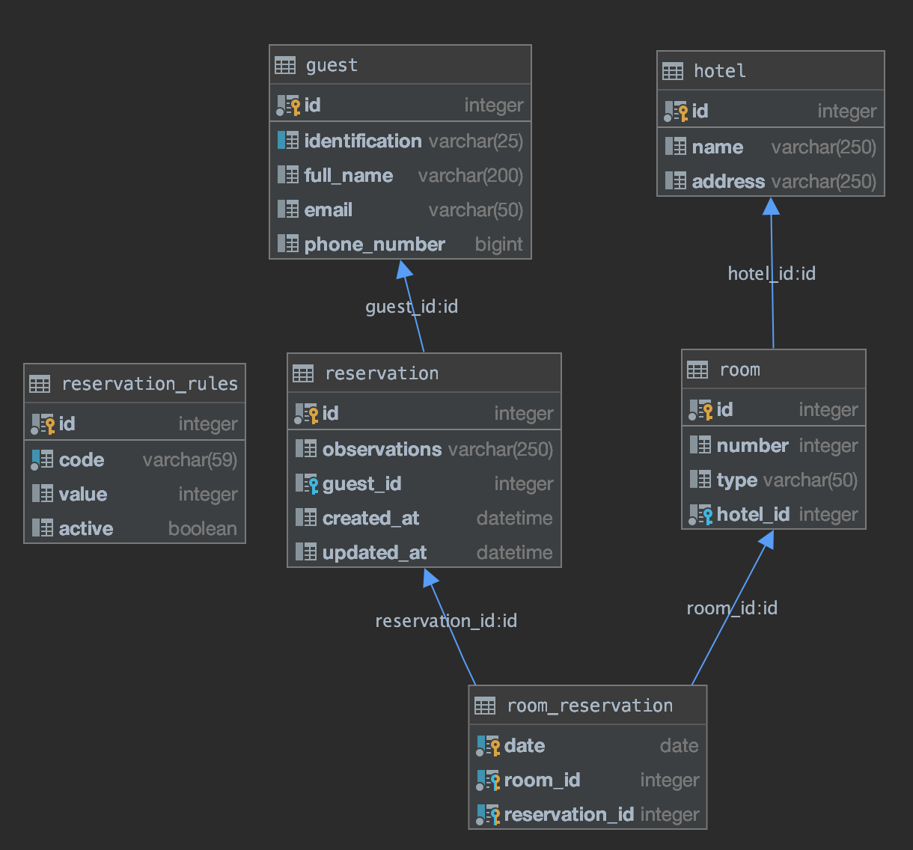

# hotel_reservation

## Stack
- Python 3.8
- FastAPI
- Uvicorn
- SqlAlchemy
- SQLite
- Alembic

## Installing needed libraries 
```shell script
pipenv shell
pipenv sync
```

## Running App Locally
- Creating database
```shell script
make db
```
or

```shell script
pipenv run makemigrations
pipenv run migrate
```

- Populate db with initial data. (Hotel, Room and Reservations Rules )

```shell script
pipenv run seed
```

- Starting App
```shell script
make start
```

- Running tests
```shell script
make test
```
or
```shell script
pipenv run pipenv run pytest tests/unit
pipenv run pytest tests/integration
```
## Running App in Docker
If you have Docker installed on your machine to run the App just execute:
```shell script
make start-w-docker
```

# Description
The app architecture was made using patterns as multi-layer and client server
#### Layers
- Controllers (Manage user interfaces)
- Services (Business logic)
- Models (Database access)

## Endpoints documentation
Endpoints documentation and schemas are generated in swagger taking advantage of this FastAPI feature.
Once the App is running you can open ``{server:port}/docs`` url.

[local swagger url](http://0.0.0.0:8080/docs)

## Database model



